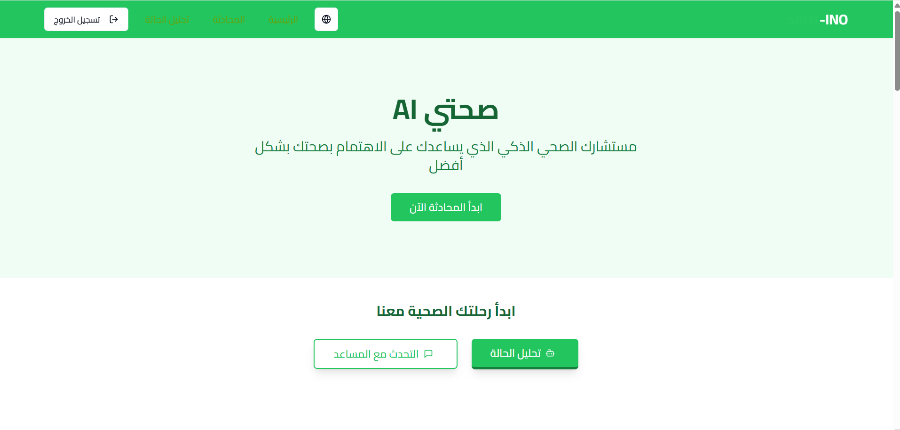
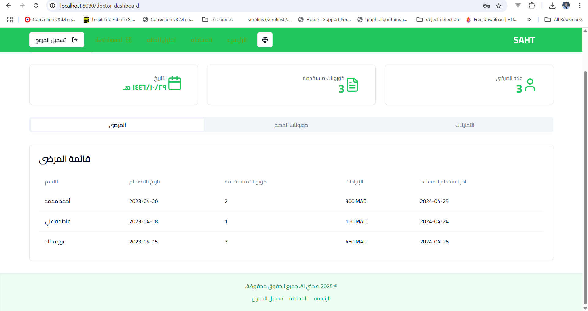
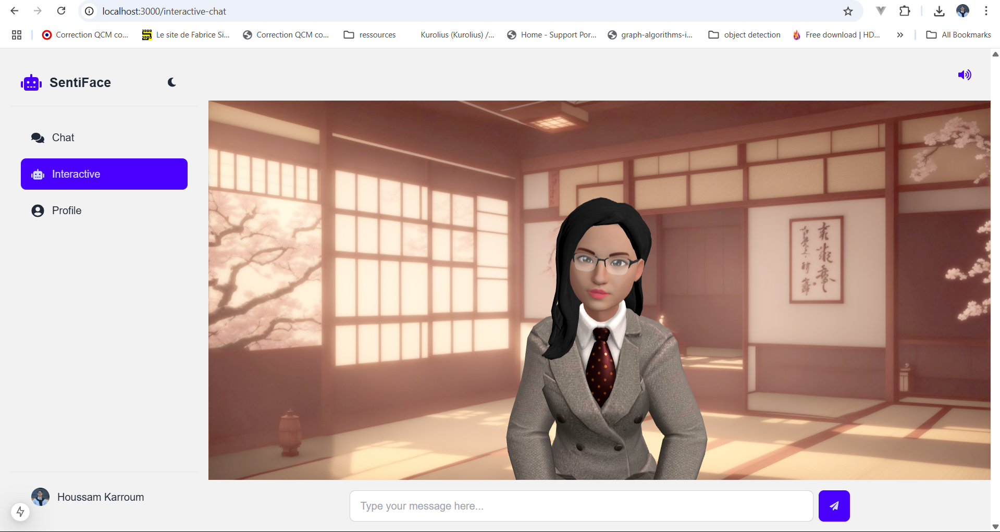
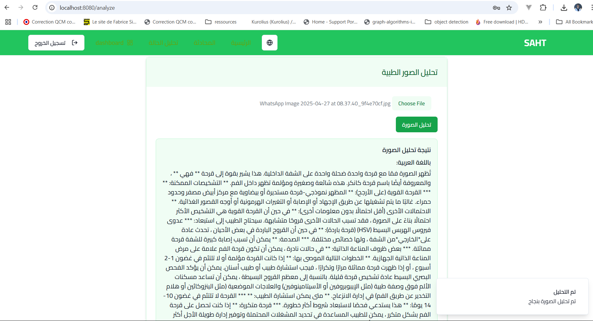
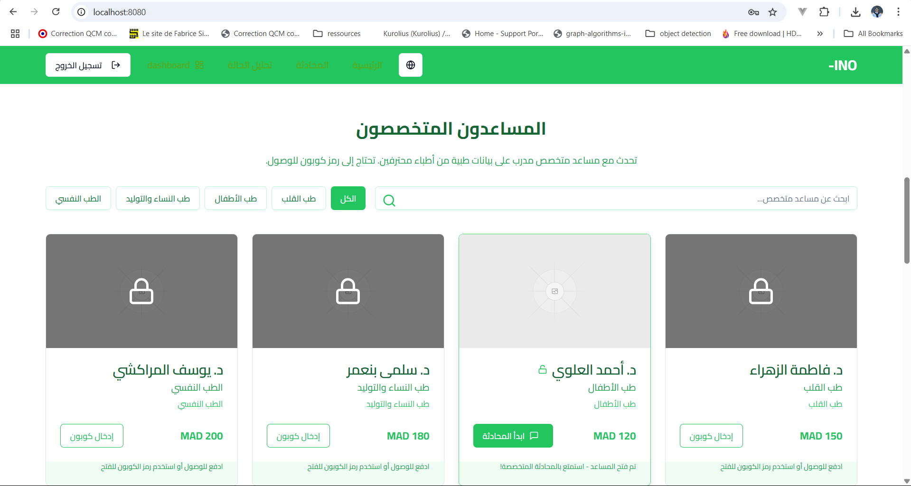

````md
# Project Setup Guide

Welcome! Follow these simple steps to install and run the project locally.

## 🚀 Getting Started

### Step 1: Clone the Repository

```bash
git clone <YOUR_GIT_URL>
```
````

### Step 2: Navigate to the Project Directory

```bash
cd <YOUR_PROJECT_NAME>
```

### Step 3: Install Dependencies

```bash
npm install
```

### Step 4: Start the Development Server

```bash
npm run dev
```

This will start the server with auto-reloading and an instant preview.

## 🛠️ Editing the Project

### Edit a File Directly in GitHub

- Navigate to the desired file.
- Click the "Edit" button (pencil icon) at the top right.
- Make your changes and commit.

_Image Example:_

### Use GitHub Codespaces

- Go to the main page of your repository.
- Click the "Code" button (green).
- Select the "Codespaces" tab.
- Click "New codespace" to launch.
- Edit your files and commit/push your changes.

_Image Example:_

## 🧰 Built With

- Vite
- TypeScript
- React
- shadcn-ui
- Tailwind CSS

## 🚀 Deploying the Project

You can easily deploy this project via Lovable:

- Open the project link above.
- Click Share → Publish.

_Image Example:_

## 🌐 Connect a Custom Domain

Yes, you can connect your own domain!

- Go to Project → Settings → Domains.
- Click Connect Domain.

Full guide: Setting up a custom domain.

_Image Example:_

## 👇 Screenshots Section

Here you can add any other screenshots showcasing your application UI or features!

```


``







```
